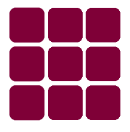

# Project-CodeWizards

Цей
[проєкт](https://kanteriv.github.io/Project-CodeWizards/index.html#fruits-section-id)
було створено за допомогою [Vite](https://vitejs.dev/). Проєкт створено
відповідно до технічних вимог та
[макету](https://www.figma.com/file/Cla5Fcn9N0N72OUITsUE4X/Fresh-Harvest-Box?type=design&node-id=4-123&t=aTfkgVJkdI5v9Mvh-0).

- Файли розмітки компонентів сторінки лежать в папці `src/partials` та
  імпортовані до файлу `index.html`.
- Файли стилів лежать в папці `src/css` та імпортовані до HTML-файлів сторінок.
  Наприклад, для `index.html` файл стилів називається `index.css`.
- Зображення оптимізовані та додані до папки `src/img`.

---

## HEADER [^1]

[^1]: Ігор Кантер - Team-lead

Файл з розміткою хедера `header.html` створено у папці `partials` та імпортовано
в `index.html`. Структура header:

- навігаційне меню з якірними посиланнями, що ведуть до відповідних розділів
  сторінки (виконане за допомогою списку);
- ;
- кошик.

Так, як сайт адаптований під різні пристрої, то для мобільного в header є тільки
логотип та кнопка виклику меню, яке виїжджає праворуч та має якірні посилання.

## HERO [^2]

[^2]: Олександр​ Меленний​

- анімований заголовок (анімація вмикається при завантаженні сайту)
- короткий опис про компанію;
- яскраві контентні зображення.
- анімаційна кнопка з посиланням, по якій можна потрапити на секцію фрутс.

## HOW IT WORKS [^3]

[^3]: Роман​ Лінкевич

- заголовок;
- параграф;
- Покрокова інструкція (виконана у вигляді списку з застосуванням стилів);
- gif (дляпривертання уваги клієнтів)

## FRUITS [^4]

[^4]: Денис​ Маховський

- заголовок;
- параграф;
- анімовані зображення;
- анімована кнопка 'замовити' при натисканні на неї відкривається модальне вікно
  для замовлення.

## ORDER-MODAL [^5]

[^5]: Дарина ​Голікова​, Ігор Гребінчук

- заголовок;
- кнопка закриття;
- список з картками:
  - заголовок;
  - параграф;
  - зображення;
  - чекбокс;
- зображення;
- форма:
  - input (є три, кожен має підказку);
  - textarea;
  - кнопка підтвердження замовлення.

## CONTACTS [^6]

[^6]: Андрій Іванов

- заголовок;
- список з зображеннями;
- параграф;
- форма:
  - label
    - input
  - кнопка 'надіслати' (при натисканні з'являється модальне вікно з подякою).

## THANK-YOU-MODAL [^7]

[^7]: Аліна Лисяна

- кнопка закриття;
- зображення;
- заголовок;
- параграф.

## FOOTER [^8]

[^8]: Вікторія Парпалій Scrum master

Структура footer:

- зображення;
- логотип з посиланням;
- навігаційне меню з якірними посиланнями, що ведуть до відповідних розділів
  сторінки (виконане за допомогою списку);
- посилання на соціальні мережі (виконані за допомогою списку);
- контактна інформація компанії (виконана за допомогою списку).
